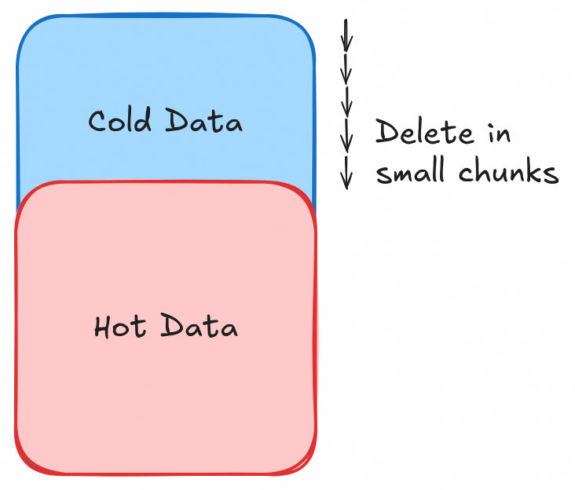
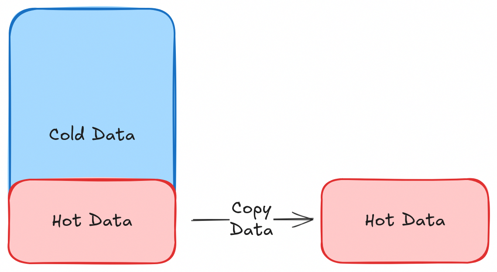
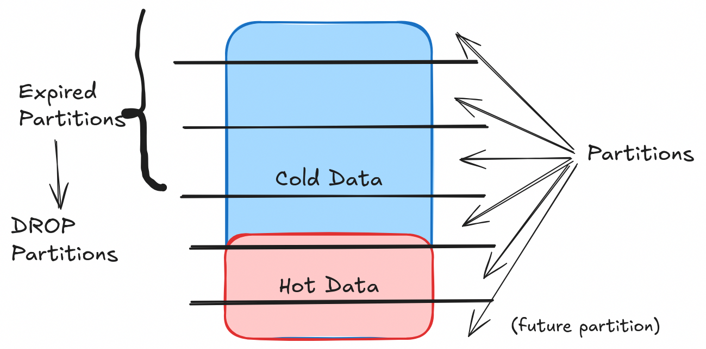

# Automating MySQL Data Purging: Our Journey to Efficient Data Management

:::tip QUOTE
Simple-sounding problems can become a real pain when scaled; what works for ten users can break down spectacularly with a million.

~ Anonymous
:::

## Introduction


In the fast-paced world of data management, handling vast amounts of data efficiently is crucial for maintaining high performance in databases. At our company, where MySQL is a core component, we encountered significant hurdles as our data volumes surged. What began as a manageable task of manual data purging soon became a complex and error-prone chore. To address this challenge, we embarked on a journey to automate MySQL data purging, aiming to streamline operations and improve both efficiency and reliability. This blog chronicles our experiences, detailing the strategies we explored, the obstacles we faced, and the solutions we implemented to achieve optimal data management.

## Why Purging?

Data purging became essential for us for several reasons:

- **Increased Disk Usage and Costs:** Unchecked data growth leads to increased disk usage and associated costs. Disk usage costs nearly doubled in just 6 months.
- **Pain of Manual Purge:** Manual purging processes were time-consuming and error-prone, leading to incidents that impacted system reliability.
- **Increasing Scale and Data Throughput:** As our operations scaled, the volume of data increased exponentially, necessitating more frequent and efficient data purging strategies. We had a monthly data throughput of over 6 TB and it was growing at an uncontrollable pace.
- **Performance Costs:** Large volumes of unused data can degrade database performance, affecting query response times and overall system efficiency.

In our case, there's no need to retain data indefinitely due to regulatory reasons, as the data primarily consists of logs and metadata. Therefore, purging the data is a viable approach.

## Approaches to Data Purging

We explored three primary approaches to automate data purging in our MySQL clusters:

### 1. Chunk Delete


Chunk deletion involves breaking down the delete operation into smaller, manageable chunks instead of attempting to delete large volumes of data in a single transaction. This minimizes locking and reduces the risk of replication lag.

##### Workflow:

1. Identify the rows to be deleted based on a specified condition (e.g., rows older than a certain date).
2. Split the deletion operation into chunks, each deleting a fixed number of rows.
3. Execute the delete operation for each chunk sequentially, depending on the system's capabilities.
4. Repeat until all identified rows are deleted.

##### Advantages:

- **Reduced Locking:** Smaller transactions reduce the duration for which the table is locked, minimizing impact on concurrent operations.
- **Manageable Load:** Distributes the load evenly over time, preventing sudden spikes in database activity.
- **Adaptable:** This method allows for flexible deletion criteria, making it possible to adjust the criteria on which data has to be deleted, as requirements change.

##### Disadvantages:

- **Slow for Large Volumes:** Deleting data in chunks can be time-consuming, especially for very large datasets.
- **Complex Implementation:** Requires careful management to ensure consistency and completeness of deletions.
- **Possible Risk of Table Locks:** There is a high risk of table-level locks when performing chunk deletes in parallel.

##### Implementation(PseudoCode):

```sql
SET @row_count = 0;
REPEAT
  DELETE FROM your_table
  WHERE <condition>
  LIMIT 1000;
  SET @row_count = ROW_COUNT();
UNTIL @row_count = 0
END REPEAT;
```

This script repeats the delete operation in chunks of 1000 rows until no more rows match the condition.

### 2. INSERT & TRUNCATE



This approach involves copying the required data to a new table in batches and then truncating the original table to remove unwanted data. This method is useful for scenarios where a significant portion of the table needs to be purged.

##### Workflow:

1. Create a new table with the same schema as the original table.
2. Insert the data to be retained into the new table in sizeable batches.
3. Rename current table to a temporary table, and make new table as current table. 
4. Re-insert the remaining data(that might have been written during batch insert) back into the current table from the temporary table.
5. Drop the temporary table used for the operation.

##### Advantages:

- **Efficiency for Large Purges:** Effective when a large percentage of the table needs to be purged.
- **Simpler Logic:** Straightforward to implement as it primarily involves data copying and truncation.

##### Disadvantages:

- **Non-Atomic Operation:** The process involves multiple steps, which are not atomic, leading to potential data inconsistency if interrupted.
- **Temporary Disk Usage:** Requires additional disk space for the temporary table holding the retained data.
- **Lossy:** In a non-locked situation, this approach may inherently ignore updates or deletions made during the process, potentially compromising data integrity.
- **Replication Lag:** During manual purges, we observed replication lag of more than 20 minutes between master and slave nodes, significantly affecting data consistency.

##### Implementation(PseudoCode):

```sql
CREATE TABLE new_table LIKE your_table;

--- Copy in small chunks if data volume is high
INSERT INTO new_table SELECT * FROM your_table WHERE <condition>;
RENAME TABLE your_table TO temp_table, new_table TO your_table;
INSERT INTO your_table SELECT * FROM temp_table WHERE <newer data post initiation of this process>;
DROP TABLE temp_table; 
```

This script transfers data, renames the original table, reinserts the new data, and finally drops the old table.

#### 3. Partitioning



:::info Partition & Performance 
 It is so tempting to believe that partitioning will solve performance problems. But it is so often wrong.

 PARTITIONing splits up one table into several smaller tables. But table size is rarely a performance issue. Instead, I/O time and indexes are the issues. [[0](https://mysql.rjweb.org/doc.php/ricksrots)]
:::

Partitioning involves dividing a table into smaller, more manageable partitions based on a specified column, such as an ID or a DateTime column. This allows for efficient purging by dropping entire partitions instead of deleting individual rows.

##### Workflow:

1. Modify the table schema to include partitioning based on a chosen column.
2. Create partitions to divide the table data according to the partition key and add `future` partition to account for future data writes.
3. For purging, drop partitions that are well past the retention period and contain no new data.
4. Create additional empty partitions to accommodate future data.

##### Advantages:

- **Efficiency:** Dropping partitions is faster and more efficient than row-by-row deletion.
- **Atomic Operation:** Partition operations are atomic, ensuring data consistency & integrity.
- **Minimal Replication Lag:** Significantly reduces replication lag during purging. (to order of ms)

##### Disadvantages:

- **Schema Changes:** Requires altering the table schema to introduce partitioning if using datetime column, as every unique key on the table must use every column in the table's partitioning expression. [[1](https://dev.mysql.com/doc/refman/8.4/en/partitioning-limitations-partitioning-keys-unique-keys.html)] 
- **Complexity in Management:** Needs careful management of partition keys and partition lifecycle.
- **Potential issues with JOIN queries:** While benchmarking, we observed a 60x slowdown in query performance on certain JOIN queries. This issue was partially mitigated by running an `ANALYZE TABLE` on the partitioned table. However, it required a thorough investigation to understand and address the performance impact fully.

##### Implementation:


```sql
ALTER TABLE your_table
PARTITION BY RANGE (PRIMARY KEY) (
  PARTITION p0 VALUES LESS THAN (1000000),
  PARTITION p1 VALUES LESS THAN (2000000),
  ...
);

-- For purging (if p0 is expired)
ALTER TABLE your_table DROP PARTITION p0;

-- Adding more partitions
ALTER TABLE your_table
    REORGANIZE PARTITION future INTO (
        p4 VALUES LESS THAN (5000000),
        future    VALUES LESS THAN MAXVALUE
    );
```

This script sets up partitioning based on a primary key column and drops partitions as needed.

### Summary

| Criteria                         | Insert & Truncate                      | Chunk Delete                      | Partitioning                      |
|----------------------------------|----------------------------------------|----------------------------------|----------------------------------|
| **Speed**                        | Moderate to Slow (2-3 hrs on 1 TB)     | Slow                             | Very Fast                         |
| **Data Consistency**             | Risk of inconsistency (during updates/deletes) | High consistency                  | High consistency                  |
| **Replication Lag**              | High                                   | High                             | Minimal                           |
| **Implementation Complexity**    | Moderate to High                       | Moderate                         | High (due to *schema changes* and *partition management*) |
| **Scalability**                  | Moderate                               | Limited to Moderate               | High                              |
| **Flexibility with Deletion Criteria** | High                                   | High                             | Moderate                          |
| **Downtime Requirement**         | Potential for downtime                 | Minimal downtime                  | No downtime            |
| **Table Lock Requirement**       | May require lock (eg during table rename)                       | No table lock required            | No table lock required            |
| **Query Performance**            | No significant impact                  | No significant impact             | Potentially impacted with JOINs   |
| **Ease of Monitoring & Debugging**| Moderate                               | Moderate to High                  | Moderate to High                  |
| **Suitability for Large Data Sets** | Limited                                | Limited                           | High                              |

### Why we preferred Partitioning?

We prefer partitioning due to its efficiency and reliability in handling large datasets. Here’s why we believe it’s the best approach:

- **Fast and Atomic:** Dropping partitions is significantly faster and ensures atomic operations, maintaining data integrity & consistency.
- **Minimal Impact on Live Systems:** It reduces replication lag and avoids locking the entire table, ensuring smooth database operations.
- **Scalability:** Partitioning efficiently manages large datasets, making it suitable for our scale of operations.

### Migrating Non-Partitioned Table to Partition Table

To implement partitioning, we needed to migrate our existing non-partitioned tables to partitioned tables. This process presented several challenges.

#### Pain Points with Migration

- **Scale:** Migrating large tables to a partitioned schema presented significant challenges.
- **Live Data:** Ensuring minimal or no downtime during migration was critical to avoid impacting live operations.
- **Schema Changes:** Implementing partitioning required schema modifications, which needed to be handled carefully to avoid disruptions.
- **Lengthy process:** To account for replication lag, we intentionally have to keep this process slow, which can be a pain to monitor!

#### Migration Strategy 

To overcome these challenges, we adopted the following strategies:

- **Using ID as Partition Column:** Instead of using a DateTime column, we used the ID column as the partition key. This avoided the need for extensive schema changes and leveraged the primary key for efficient partitioning.
- **Minimal Downtime:** We developed an automated pipeline to handle the migration process in stages, ensuring minimal impact on live systems.
- **Minimal Labor:** The labor required for migration was significant, so we developed an automated pipeline to streamline the process. Users simply need to provide a YAML configuration, and the pipeline will automatically handle migration using an "INSERT & TRUNCATE" approach, accounting for edge cases as well. We ensured that read misses of hot data were minimized to the point where they could be safely ignored.

#### Migration Workflow

Migrating our non-partitioned tables to partitioned tables required a carefully planned approach to minimize downtime and ensure data consistency. Here is a detailed breakdown of the process:

1. **Choosing the Partition Column:**
   - Initially, we considered using the DateTime column for partitioning. However, this required significant schema changes and was expensive to implement. 
   - Hence, we opted to use the ID column instead. The ID column, typically the primary key, did not require extensive schema modifications and facilitated a smoother transition.

2. **Creating Partitioned Tables:**
   - We created new tables with partitions based on the ID column. This involved defining the partitioning scheme and ensuring that the partitioning column had unique keys.
   - We ensured that indexes and necessary constraints were replicated in the new partitioned tables.

3. **Data Migration:**
   - Data migration was done in chunks to minimize the impact on live operations. We copied data from the non-partitioned tables to the new partitioned tables in batches using "INSERT & TRUNCATE" approach.
   - During this process, we maintained data consistency by ensuring that ongoing write operations to the old tables were also reflected in the new tables.

4. **Validation:**
   - After migrating the data, we validated the new partitioned tables to ensure data integrity and consistency.
   - This involved running consistency checks and comparing row counts between the old and new tables.

5. **Switchover:**
   - Once validation was complete, we performed the switchover. This involved renaming the old tables to a backup name and renaming the new partitioned tables to the original table names and ultimately dropping the old table.

6. **Post-Migration Steps:**
   - After the switchover, we monitored the performance and behavior of the new partitioned tables to ensure everything was functioning as expected.
   - We also set up appropriate monitoring and alerting for the new partitioned tables.
   We also added additional empty partitions for lookups to handle newer writes, in addition to the default future partition that we already had.

### Handling Edge cases with Archival Purge

Despite partitioning being our primary approach, we also needed an archival purge method for edge cases. This involved using insert & truncate or chunk delete depending on the volume of data to be purged. We preferred archival purge methods such as INSERT & TRUNCATE or chunk delete when query performance on partitioned tables was unpredictable or when the cost of schema changes was prohibitive.

1. **Archival Purge:**
   - For smaller deletions, chunk delete was more efficient. We deleted data in small chunks iteratively to avoid locking the entire table.
   - For larger deletions, insert & truncate was more appropriate. We copied the required data to a new table and dropped the old table.

2. **Choosing the Right Approach:**
   - The decision between chunk delete and insert & truncate was based on the percentage of data to be deleted. If the data to be deleted was less than 20% of the total rows, chunk delete was used. For larger deletions, insert & truncate was the chosen method.

3. **Ensuring Data Consistency:**
   - During repeated runs of the pipeline, we ensured data consistency by intelligently choosing between the different approaches based on the size of the data to be purged.
   - This helped in maintaining the reliability of the system and preventing any data loss.

### Why We Didn't Use Tools like pt-archiver and Maatkit

While considering different approaches to automate data purging, we evaluated existing tools like **pt-archiver** and **Maatkit** (now integrated into Percona Toolkit). These tools are widely used for archiving and purging data in MySQL databases, providing granular control and monitoring capabilities. However, there were several reasons we decided not to use them:

1. **Scalability:**  
Our database handles millions of rows daily and terabytes of data. Pt-archiver and Maatkit, while effective for smaller datasets, may not scale efficiently to our needs.

2. **Monitoring and Debugging:**  
We needed more granular monitoring and easier debugging than pt-archiver and Maatkit offer. Our custom solution provides detailed logging, alerting, and metrics specific to our needs.

3. **Complexity:**  
Configuring these tools to meet our requirements involves complex setups, increasing the risk of misconfigurations and debugging challenges.

## Results

The implementation of automated data purging yielded significant improvements:
- **Terabytes of Disk Freed:** Efficient purging freed up substantial disk space, optimizing storage utilization and reducing costs.
- **60x Decrease in Replication Lag:** The replication lag during purging operations was drastically reduced, ensuring smoother database operations.
- **Time Saved:** Automated purging saves approximately 90+ hours annually, previously spent on manual processes.

## Conclusion
Our journey toward automating MySQL data purging has been transformative, enhancing our data management practices and significantly boosting efficiency. By carefully selecting and implementing partitioning and hybrid approaches, we addressed the challenges posed by large data volumes while maintaining high performance and data integrity. The transition from manual to automated purging not only minimized replication lag and freed up valuable disk space but also saved substantial time and effort previously spent on manual processes. This experience underscores the importance of adapting data management strategies to keep pace with growing demands and highlights the benefits of continuous innovation in managing complex data environments. As we move forward, we remain committed to refining our strategies and leveraging automation to stay ahead in the ever-evolving landscape of data management.

## Good Reads

1. https://mysql.rjweb.org/doc.php/partitionmaint
2. https://mysql.rjweb.org/doc.php/deletebig
3. https://docs.percona.com/percona-toolkit/pt-archiver.html
