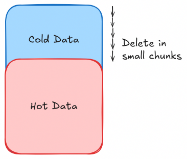

# Navigating Large-Scale Data Purging in MySQL

:::tip QUOTE
Simple-sounding problems can become a real pain when scaled; what works for ten users can break down spectacularly with a million.

\~ Anonymous
:::

[[toc]]

## Introduction


In the fast-moving world of data management, managing large amounts of data effectively is key to keeping databases running smoothly. When data volumes grow, manual data cleaning can become difficult and prone to mistakes. To tackle this problem, many people turn to automating cleaning data in MySQL. This blog explains how to set up automated data cleaning, covers common challenges, and offers solutions for better data management.

## Why Purging?

Data purging has become essential for several reasons:

*   **Increased Disk Usage and Costs:** Unchecked data growth will lead to increased disk usage and associated costs.
*   **Performance Costs:** Large volumes of unused data can degrade database performance, affecting query response times and overall system efficiency.
*   **Pain of Manual Purge:** Manual purging processes are time-consuming and error-prone and may impact system reliability.

Purging is especially suitable when there’s no need to keep data forever bound by regulatory reasons, such as with logs and metadata.

## Approaches to Data Purging

There are three primary approaches to purge tables in MySQL clusters:

### 1. Chunk Delete



Chunk deletion involves breaking down the delete operation into smaller, manageable chunks instead of attempting to delete large volumes of data in a single transaction. This minimizes locking and reduces the risk of replication lag.

#### Workflow

1.  Identify the rows to be deleted based on a specified condition (e.g., rows older than a certain date).
2.  Split the deletion operation into chunks, each deleting a fixed number of rows.
3.  Execute the delete operation for each chunk sequentially, depending on the system's capabilities.
4.  Repeat until all identified rows are deleted.

#### Advantages

*   **Reduced Locking:** Smaller transactions reduce the time the table is locked, minimizing the impact on concurrent operations.
*   **Manageable Load:** Distributes the load evenly over time, preventing sudden spikes in database activity.
*   **Adaptable:** This method allows for flexible deletion criteria, making it possible to adjust the criteria on which data has to be deleted, as requirements change.

#### Disadvantages

*   **Slow for Large Volumes:** Deleting data in chunks can be time-consuming, especially for huge datasets.
*   **Complex Implementation:** Requires careful management to ensure consistency and completeness of deletions.
*   **Possible Risk of Table Locks:** There is a high risk of table-level locks when performing chunk deletes in parallel.

#### Implementation(PseudoCode)

```sql
SET SQL_LOG_BIN=0; -- Disable binary logging to avoid increased log size
SET @row_count = 0;
REPEAT
  DELETE FROM your_table
  WHERE <condition>
  LIMIT 1000;
  SET @row_count = ROW_COUNT();
  -- Sleep for a few seconds to avoid high replication lag
UNTIL @row_count = 0
END REPEAT;

ANALYZE TABLE your_table; -- or OPTIMIZE
```

This script repeats the delete operation in chunks of 1000 rows until no more rows match the condition.

### 2. INSERT & TRUNCATE


This approach involves copying the required data to a new table in batches and then truncating the original table to remove unwanted data. This method is useful for scenarios where a significant portion of the table needs to be purged.

#### Workflow

1.  Create a new table with the same schema as the original table.
2.  Insert the data to be retained into the new table in sizeable batches.
3.  Rename the current table to a temporary table, and make the new table as the current table.
4.  Re-insert the remaining data(that might have been written during batch insert) back into the current table from the temporary table.
5.  Drop the temporary table used for the operation.

#### Advantages

*   **Efficiency for Large Purges:** Effective when a large percentage of the table needs to be purged.
*   **Simpler Logic:** Straightforward to implement as it primarily involves data copying and truncation.

#### Disadvantages

*   **Non-Atomic Operation:** The process involves multiple steps, which are not atomic, leading to potential data inconsistency if interrupted.

*   **Temporary Disk Usage:** Requires additional disk space for the temporary table holding the retained data.

*   **Lossy:** In a non-locked situation, this approach may inherently ignore updates or deletions made during the process, potentially compromising data integrity.
    > [!TIP]
    > For a fix we can create a [trigger](https://dev.mysql.com/doc/refman/8.4/en/create-trigger.html) on UPDATE that writes to the new table during copying.

*   **Replication Lag:** During manual purges, with master-slave configuration, there are chances of high replication lag between the master and slave node, significantly affecting data consistency.

#### Implementation(PseudoCode)

```sql
SET SQL_LOG_BIN=0; -- Disable binary logging to avoid increased log size
CREATE TABLE new_table LIKE your_table;

-- Copy data in small chunks if the data volume is high (with some sleep in between)
-- (Actual implementation of chunked copying is left for brevity)
INSERT INTO new_table
SELECT * FROM your_table
WHERE <ttl condition>;  -- Specify the condition to filter the data to be copied

-- Optionally check and copy if more rows have arrived during batch insert
-- and the count exceeds a threshold of one batch
-- This step ensures read miss duration is minimum
-- (This logic is also left for brevity)

-- At last, if more rows have arrived than a threshold (say 25k),
-- then copy them all in a single go
-- (This logic is left for brevity as well)

ALTER TABLE new_table AUTO_INCREMENT = <max ID of old_table + avg_write_per_sec * total time per table>; -- Alternate might be increment QUERY_EXECUTION_TIME * COEFFICIENT (1.25 to 25), where COEFFICIENT is the time for binlog to replicate from one node to other

SET TRANSACTION ISOLATION LEVEL SERIALIZABLE;
START TRANSACTION;
RENAME TABLE your_table TO temp_table, new_table TO your_table;
INSERT INTO your_table
SELECT * FROM temp_table
WHERE <newer data post initiation of this process>;  -- Specify the condition to filter the newer data
COMMIT;

-- Isolation level is automatically changed back to normal (REPEATABLE READ) in MySQL

DROP TABLE temp_table;

ANALYZE TABLE your_table; -- or OPTIMIZE
```

This script transfers data, renames the original table, reinserts the new data, and finally drops the old table.

> [!WARNING]
> Before renaming the table, we set the AUTOINCREMENT value of the new table to a value bit more than the maximum value of the old table(to avoid any INSERT conflicts)!
> 
> But this can cause some issues, if the value AUTOINCREMENTed is too large, and the system reading this table didn't expect such a large jump.

### 3. Partitioning


> [!NOTE] Partition & Performance
> It is so tempting to believe that partitioning will solve performance problems. But it is so often wrong.
> 
> PARTITIONing splits up one table into several smaller tables. But table size is rarely a performance issue. Instead, I/O time and indexes are the issues. \[[0](https://mysql.rjweb.org/doc.php/ricksrots)]
> 

Partitioning involves dividing a table into smaller, more manageable partitions based on a specified column, such as an ID or a DateTime column. This allows efficient purging by dropping entire partitions instead of deleting individual rows.

#### Workflow

1.  Modify the table schema to include partitioning based on a chosen column.
2.  Create partitions to divide the table data according to the partition key and add a `future` partition to account for future data writes.
3.  For purging, drop partitions that are well past the retention period and contain no new data.
4.  Create additional empty partitions to accommodate future data.

#### Advantages

*   **Efficiency:** Dropping partitions is faster and more efficient than row-by-row deletion.
*   **Atomic Operation:** Partition operations are atomic, ensuring data consistency & integrity.
*   **Minimal Replication Lag:** Significantly reduces replication lag during purging. (to order of ms)

#### Disadvantages

*   **Schema Changes:** Requires altering the table schema to introduce partitioning if using a datetime column, as every unique key on the table must use every column in the table's partitioning expression. \[[1](https://dev.mysql.com/doc/refman/8.4/en/partitioning-limitations-partitioning-keys-unique-keys.html)]
*   **Complexity in Management:** Needs careful management of partition keys and partition lifecycle.
*   **Potential issues with JOIN queries:** With existing queries, there might be some slowdown in query performance on certain JOIN queries in case of a partition migrated table. This issue can be partially mitigated by running an `ANALYZE TABLE` on the partitioned table.

#### Implementation

```sql
CREATE temp_table LIKE your_table;

ALTER TABLE temp_table
PARTITION BY RANGE (PRIMARY KEY) (
  PARTITION p0 VALUES LESS THAN (1000000),
  PARTITION p1 VALUES LESS THAN (2000000),
  -- Add more partitions as needed
);

-- Follow the steps of the INSERT & TRUNCATE process to copy data into temp_table and make it the main table
-- (Refer to the previously discussed steps in the "INSERT & TRUNCATE" section, implementation left for brevity)

-- For purging (if p0 is expired)
ALTER TABLE your_table DROP PARTITION p0;

-- Adding more partitions
ALTER TABLE your_table
    REORGANIZE PARTITION future INTO (
        p4 VALUES LESS THAN (5000000),
        future    VALUES LESS THAN MAXVALUE
    );
```

This script sets up partitioning based on a primary key column and drops partitions as needed.

### Summary

| Criteria                               | Insert & Truncate                              | Chunk Delete           | Partitioning                                              |
| -------------------------------------- | ---------------------------------------------- | ---------------------- | --------------------------------------------------------- |
| **Speed**                              | Moderate to Slow (2-3 hrs on 1 TB)             | Slow                   | Very Fast                                                 |
| **Data Consistency**                   | Risk of inconsistency (during updates/deletes) | High consistency       | High consistency                                          |
| **Replication Lag**                    | High                                           | High                   | Minimal                                                   |
| **Log Size**          | Moderate to High                               | High               | Minimal |
| **Implementation Complexity**          | Moderate to High                               | Moderate               | High (due to *schema changes* and *partition management*) |
| **Scalability**                        | Moderate                                       | Limited to Moderate    | High                                                      |
| **Flexibility with Deletion Criteria** | High                                           | High                   | Moderate                                                  |
| **Downtime Requirement**               | Potential for downtime                         | Minimal downtime       | No downtime                                               |
| **Table Lock Requirement**             | May require lock (eg during table rename)      | No table lock required | No table lock required                                    |
| **Query Performance**                  | No significant impact                          | No significant impact  | Potentially impacted with JOINs                           |
| **Ease of Monitoring & Debugging**     | Moderate                                       | Moderate to High       | Moderate to High                                          |
| **Suitability for Large Data Sets**    | Limited                                        | Limited                | High                                                      |

## When to prefer Partitioning?

When on a large scale, one should prefer partitioning due to its efficiency and reliability in handling large datasets. Here’s why I believe it might be the best approach:

*   **Fast and Atomic:** Dropping partitions is significantly faster and ensures atomic operations, maintaining data integrity & consistency.
*   **Minimal Impact on Live Systems:** It reduces replication lag and avoids locking the entire table, ensuring smooth database operations.
*   **Scalability:** Partitioning efficiently manages large datasets, making it suitable for our scale of operations.

> [!NOTE]
> If you don't want to get through all this complexity and granular monitoring
is not an issue for you, then prefer using [Percona Toolkit's pt-archiver](https://docs.percona.com/percona-toolkit/pt-archiver.html) for purging data and [pt-online-schema-change](https://docs.percona.com/percona-toolkit/pt-online-schema-change.html) for schema changes.

## Migrating Non-Partitioned Table to Partition Table

To implement partitioning, we need to migrate our existing non-partitioned tables to partitioned tables. This process may present several challenges.

### Pain Points with Migration

*   **Scale:** Migrating large tables to a partitioned schema can be time-consuming and slow.
*   **Live Data:** Ensuring minimal or no downtime during migration will be critical to avoid impacting live operations.
*   **Schema Changes:** Implementing partitioning required schema modifications, which needed to be handled carefully to avoid disruptions.
*   **Lengthy process:** To account for replication lag, we intentionally have to keep this process slow, which can be a pain to monitor!
* **Logs:** Migrating large volumes of data can generate a massive amount of binary logs, which need to be handled separately.

> [!NOTE]
> While migrating, log size can become a limiting bottleneck, as it can fill up the disk space quickly, even if you drop the older table.
> 
> To handle the log size, one can set the following global variables in MySQL(values are advisory and can be adjusted based on the requirement):
> ```sql
> SET GLOBAL expire_logs_days = 3; -- To keep logs for only 3 day
> SET GLOBAL binlog_expire_logs_seconds = 259200; -- To keep logs for only 3 day
> SET GLOBAL binlog_format = 'ROW'; 
> SET GLOBAL binlog_row_image = 'minimal'; -- To reduce log size
> SET GLOBAL innodb_log_file_size = 1073741824; -- 1 GiB 
> SET GLOBAL max_binlog_size = 1073741824; -- 1 GiB
> ```

### Migration Strategy

To overcome these challenges, one can adopt the following strategies:

*   **Using ID as Partition Column:** Instead of using a DateTime column, we can use the ID column as the partition key. This will also help avoid extensive schema changes. [Primary Key is also the clustered Key in InnoDB](https://dev.mysql.com/doc/refman/8.4/en/innodb-index-types.html), which makes it an excellent candidate for partitioning.
*   **Approach:** Handle migration using an "INSERT & TRUNCATE" approach, accounting for edge cases as well. We need to ensure that read misses of hot data are minimized to the point where they can be safely ignored.
*   **Pre-verification:** Please conduct thorough checks to *confirm the presence of appropriate indexes* on the datetime column and to ensure the data type is correct, ensuring the process runs efficiently.

### Migration Workflow

Migrating non-partitioned tables to partitioned tables requires a carefully planned approach to minimize downtime and ensure data consistency. Here is a detailed breakdown of the process:

1.  **Creating Partitioned Tables:**
    
    *   Create new tables with partitions based on the ID column. This involved defining the partitioning scheme and ensuring that the partitioning column had unique keys.
    *   Ensure that indexes and necessary constraints are replicated in the new partitioned tables.
    *   It's recommended to have additional empty partitions for lookups to handle newer writes, in addition to the default future partition that we have.

3.  **Data Migration:**

    *   Data migration should be done in chunks to minimize the impact on live operations. Copy data from the non-partitioned tables to the new partitioned tables in batches using the "INSERT & TRUNCATE" approach.
    *   During this process, ongoing write/update operations to the old tables should also be reflected in the new tables to ensure data consistency. To implement that, one can use triggers in MySQL.

## Handling Edge Cases with Archival Purge

Even though partitioning is usually the main method, you'll need an archival purge method for certain situations. This means using either insert & truncate or chunk delete, depending on how much data you need to remove. Use these methods when partitioned table performance is unreliable or changing the schema is too costly.

   *   For smaller deletions, chunk delete is more efficient.
   *   For larger deletions, insert & truncate is more appropriate.
   *   During repeated runs of the pipeline, choose intelligently between the different approaches based on the size of the data to be purged for faster and more efficient runs.

## General Notes

1. To handle high replication lag, please try keeping a 5~10s between each chunk delete or batch insert. Also ensure that chunk/batch size is not too large, and not too small either.
2. Increase MySQL [wait timeout](https://dev.mysql.com/doc/refman/8.0/en/server-system-variables.html#sysvar_wait_timeout) to a higher value, to avoid any [timeout issues](https://perconadev.atlassian.net/browse/PT-682) during the process.
    ```sql
    SET SESSION wait_timeout = 28800; -- 8 hours
    ```
3. Try sending keep alive queries in MySQL like `SELECT 1` to avoid any connection timeout issues while sleeping.
4. Set `AUTOCOMMIT=1` to avoid any transaction issues.
    ```sql
    SET SESSION AUTOCOMMIT=1;
    ```
5. It is generally observed that [LOAD INFILE REPLACE](https://dev.mysql.com/doc/refman/8.4/en/load-data.html) is faster than batch INSERT in "INSERT & TRUNCATE" method. So, you can choose wisely as per the needs.
6. Although, we didn't cover the case with foreign keys, one can simple use `SET FOREIGN_KEY_CHECKS=0;` before the process of Delete/Drop!
7. It's recommended to run `ANALYZE TABLE` or `OPTIMIZE TABLE` after the process to make the Query Optimizer happy. OPTIMIZE table takes longer to run on big tables, so use ANALYZE TABLE instead.

> [!NOTE]
> I do a bit of assumption while writing this blog, like the table is InnoDB, and the MySQL version is 8.0.
> 
> Also, the steps are not exhaustive and has to be modified as per buisness usecase. User discretion is advised. :wink:

## Conclusion

Purging large MySQL tables can be tricky, but choosing the right method makes it easier. **Chunk Deletion** works well for gradual, smaller deletions, while **Insert & Truncate** is better for big purges where you need to clear a lot of data quickly. **Partitioning** is ideal for very large datasets, making data management more efficient by splitting tables into smaller parts. Pick the method that best fits your needs to keep your database running smoothly.

## Good Reads

1.  <https://mysql.rjweb.org/doc.php/partitionmaint>
2.  <https://mysql.rjweb.org/doc.php/deletebig>
3.  <https://docs.percona.com/percona-toolkit/pt-archiver.html>
