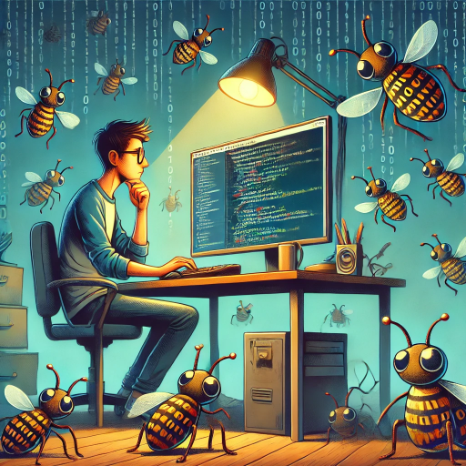
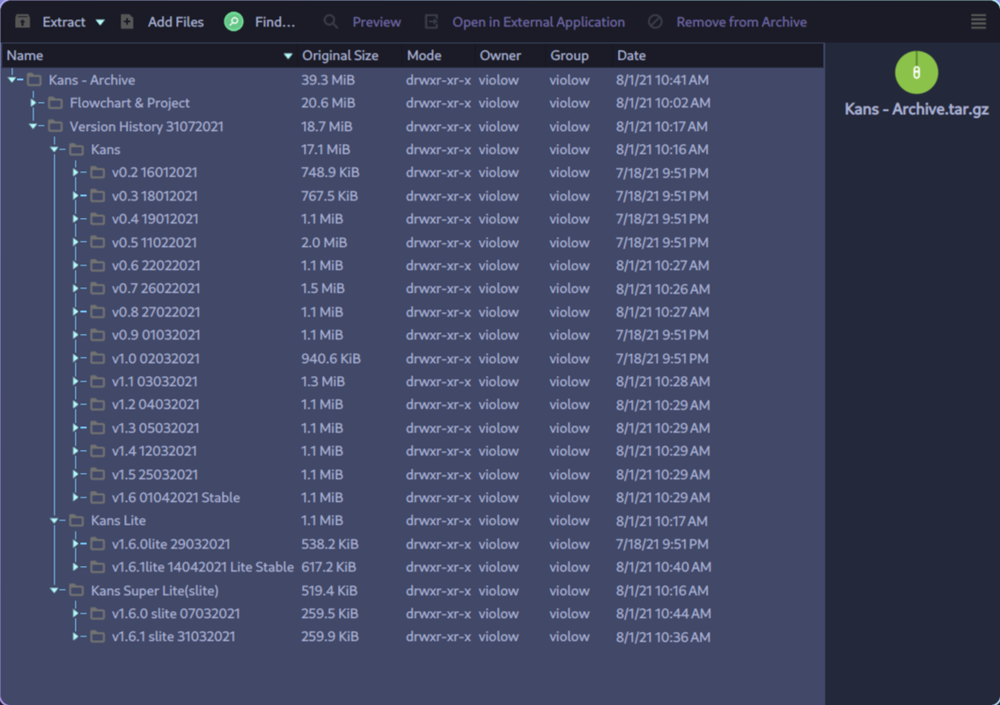

# Embracing Bugs: How Writing Imperfect Code Helps You Grow

> In this post, I'll explore how dealing with bugs is crucial for becoming a better developer. Rather than aiming for perfection, we’ll look at how debugging and imperfect code improve problem-solving skills, deepen understanding of programming principles, and lead to more thoughtful coding practices. Reflecting on my own journey with various languages and tools, I'll illustrate how grappling with bugs has shaped my approach to coding and contributed to significant personal and professional development.

## Introduction

::: info _Have no fear of perfection—you’ll never reach it._

~ Salvador Dalí
:::

Intriguing, isn't it? When everyone around you—your college professors, teammates, and online communities—stresses the importance of writing clean, scalable code that can handle billions of users, why on earth would I suggest you should write buggy code? Let me tell you why.

As C.S. grads, we’re often expected to produce clean, scalable, maintainable, readable, testable, portable, performant, secure, documented, optimized, and bug-free code—essentially, perfect code—on our first try. And we’re supposed to do it all on the first try! These unrealistic expectations often push us to focus on following the "rules" rather than understanding the reasons behind them. When was the last time you genuinely reasoned about why you were using one design pattern over another? Maybe you just used it because everyone else did. We often forget to question and just follow the herd.

## My Journey of Embracing Buggy Code

### The Early Days: MSW Logo and Python

I started my programming journey in the early 2010s. My first encounter was with [MSW Logo](https://en.wikipedia.org/wiki/MSWLogo), a simple language where you could control a little turtle by giving commands like FORWARD, LEFT, and RIGHT. Think of it like a modern-day [Scratch](https://scratch.mit.edu). I loved the simplicity and beauty of that language; I was quickly hooked!

As time passed, I dabbled with HTML, QBASIC, and other languages. However, coding still didn’t feel all that exciting to me. I appreciated the idea of coding, but I couldn’t truly enjoy it.

Then came the moment when I was introduced to Python. I was in my +2 grade, and we had to create a small project for our finals. Even though it was a group project, I ended up doing most of the work! At that time, I thought GitHub was just like Google Drive for code. I had no idea what version control systems were or what "clean code" meant. And I didn't care to know. My primary goal was to make it work! I straight-up ignored things like security (SQL injections, anyone?), modularity (my project had over 6000 lines of code in a single file), and memory management issues (as long as the memory errors didn’t crash my program immediately, they weren’t a problem). And that was completely fine! This was the beginning of my journey. The project wasn’t intended to be a professional masterpiece; it was just a school assignment.

### The Learning Curve: Packaging, Debugging, and the Real World

Then came the time for our practical exams. The project stood out, and a few of my friends wanted to run it on their computers. That’s when the problems started. I began by telling them, "Install Python, then install these dependencies, and then run the code!" This is where they lost interest. No one wants to set up Python and install dependencies—they wanted a simple `.exe` file that would just run. That’s when I started learning about packaging and distribution.

I discovered tools like PyInstaller, which helped me package my Python code into an executable file. (Back then, tools like Poetry weren’t popular, and virtual environments and dependency management were concepts I couldn’t even think about!) I even used Inno Setup to create an installer for Windows. Then I heard about Nuitka, which promised to compile Python code into more efficient executables. My first experience with Nuitka was a nightmare—it took 2 to 4 hours just to compile my code, thanks to Windows Defender! That’s when I switched to Linux (Zorin OS), and everything changed. Suddenly, I was learning about path handling, cross-platform compatibility, and performance optimization—concepts I had never considered before. Packaging and compiling Python became quite an experience!

### Embracing Low-Level Programming: CS50x and C

Upon coming to college, I was introduced to CS50x, an introductory course by Harvard that really helped me embrace low-level design concepts. I remember diving into the optional assignments just because they were so well chosen and engaging! This course got me hooked on C programming. And then came the infamous SEGMENTATION FAULT. That was my introduction to debugging with tools like Valgrind, which helped me understand memory management and what it truly means to "talk" to the code. Debugging became less about fixing problems and more about understanding the intricate dance between hardware and software.

### Discovering Rust: The Beauty of Thoughtful Design

Later, a few of my college seniors introduced me to Rust. Initially, I couldn’t fully appreciate the beauty of what seemed like such a complex masterpiece. Rust was difficult, I admit, but it was equally rewarding. The beauty of this language lies not just in its syntax or its features but in the community and processes that shape it. The development of Rust involves a lot of discussion, resolution, documentation, and RFCs (Requests for Comments) to refine the language into something so well-designed.

As a beginner developer, I used to code first and think about architecture later. However, interacting with the Rust community taught me to approach coding differently. I began to think more critically before diving into writing code. This shift in mindset helped me immensely in designing systems that truly matched my vision. For example, I once rewrote the lexer and parser for a domain-specific language (DSL) _three times_ just because I hadn't defined the grammar properly beforehand. (Fun fact: you can check out that project [here](https://github.com/rootCircle/cpast)). This experience taught me the importance of planning and design in software development—an invaluable lesson that has shaped how I approach projects ever since.

These beautifully crafted software tools, like Rust, involve a lot of discussion, resolution, documentation, and RFCs to be so refined. As beginner developers, we often code first and think about architecture later. But this interaction with Rust's development process taught me to think first and code later. This approach helped me in designing systems that truly fulfilled my vision.

### Navigating College with Limited Resources: Linux and Efficiency

When I entered the college world, I had a pretty decent laptop with 4GB of RAM—at a time when 16GB RAM and the latest CPUs were becoming the norm. This limitation pushed me to explore more efficient software environments. I started using Linux, beginning with Zorin OS. However, I soon found the outdated packages to be a problem and eventually switched to Arch Linux. Arch has been my home for the past two years. Using Linux allowed me to explore topics like OS internals in depth. While these concepts are often described as being complex, I found that they were quite simple once you dug into them, even if they seemed out of reach for the average user.

I also began reading blogs on Reddit and Hacker News in my free time. These platforms became invaluable resources for learning about new tools, languages, and best practices from the broader developer community.

### Appreciating Constraints and Design Choices

In the early days of my coding journey, I enjoyed the flexibility of languages like Python, where dynamic typing and other conveniences made programming feel easy and fun. I loved that arrays in Python (technically lists) could change size dynamically, unlike in C, where arrays have a fixed size. The freedom to change variable types on the fly felt liberating compared to the rigidity of static typing in languages like C. At the time, the constraints of static typing and fixed-size arrays seemed unnecessarily restrictive.

However, as I delved deeper into the internals of programming languages and systems, my appreciation shifted dramatically. I began to understand the importance of memory management, type safety, and predictability—concepts that are often taken for granted in dynamic languages. I came to embrace the very features I once found limiting. I realized that having a fixed array size in C wasn’t just a quirk of the language—it was a deliberate design choice that offers performance benefits and memory efficiency. Similarly, static typing, which I initially found cumbersome, now felt like a guiding hand ensuring code correctness and stability.

After learning about the internal workings of computers and how programming languages interact with hardware, I grew to appreciate the reliability and clarity provided by taking those decisions.

## The Role of Buggy Code in Learning

One can never truly understand the importance of coding modularity until they've experienced the chaos of spaghetti code crammed into a single file. The value of clean code only becomes clear after struggling to make sense of something written a month prior. The need for testable code is realized when frequent prototyping and updates lead to a tangled mess. The necessity of integration tests becomes apparent when code that seemed fine in development starts breaking in production, proving that unit tests alone aren't sufficient.

The significance of secure coding hits home after falling victim to a hack. Optimized code becomes essential when working with limited resources, like a PC with just 2GiB of RAM.  Embracing memory safety only makes sense after encountering a segmentation fault. The benefits of static typing in a language are felt after battling with a stubborn LSP for hours. The pitfalls of hacky solutions become evident when a rushed fix leads to the need for a complete codebase rewrite. The necessity of architecting a product before diving into coding becomes clear after the arduous process of rewriting a disorganized codebase that became a maintenance nightmare. Additionally, the importance of thorough documentation only becomes apparent when the [_bus factor_](https://en.wikipedia.org/wiki/Bus_factor) kicks in.

## Conclusion

So, why should you write buggy code? Because it's through writing buggy code that you learn to appreciate the principles of good software development. Writing buggy code helps you understand why best practices exist in the first place. Bugs push you to learn, adapt, and grow. They teach you to think critically, to ask questions, and to seek better solutions. So don’t be afraid of writing buggy code—embrace it as part of your journey to becoming a better developer!

One thing I would strongly advise is to try making something you genuinely want to use. When you create a project that excites you, it changes the entire process. And when you show it to someone, you can proudly say, "I made this," with the confidence of putting on a pair of cool sunglasses. That sense of pride and ownership is what drives innovation and learning.

:::info Perfection is not attainable, but if we chase perfection we can catch excellence.
~ Vince Lombardi
:::
