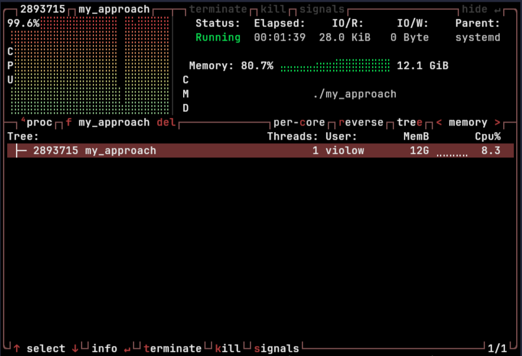
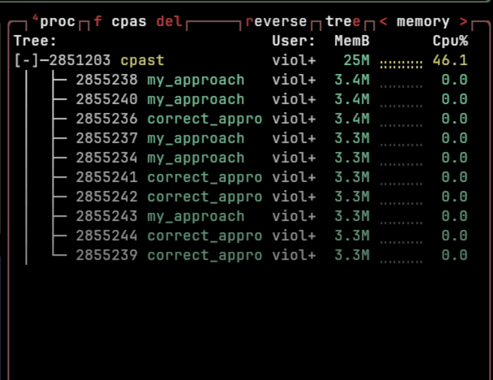
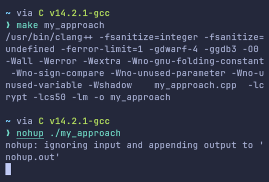
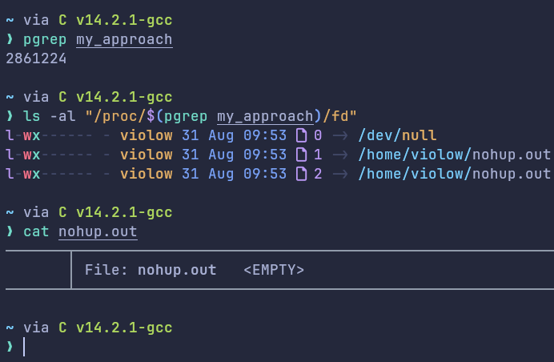
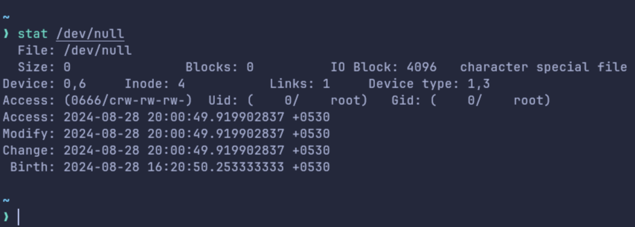
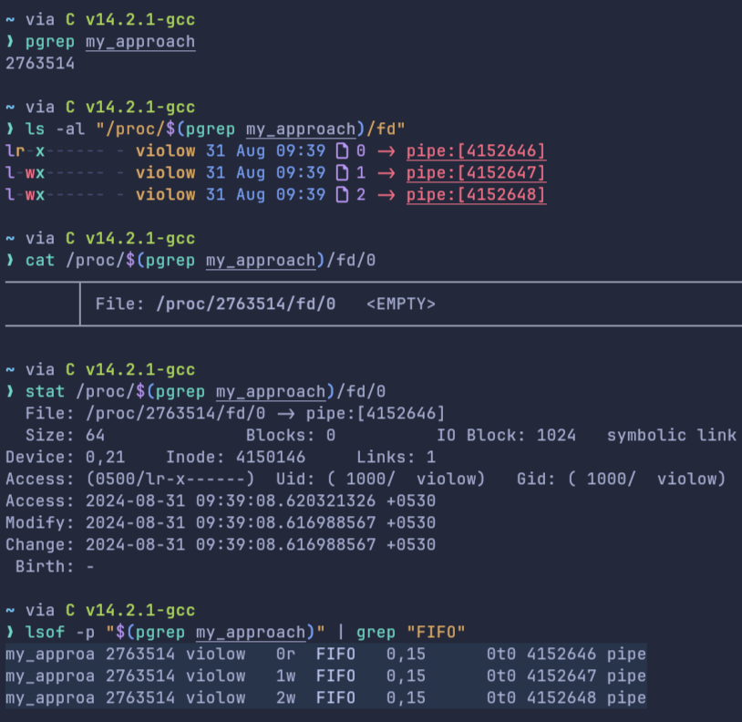
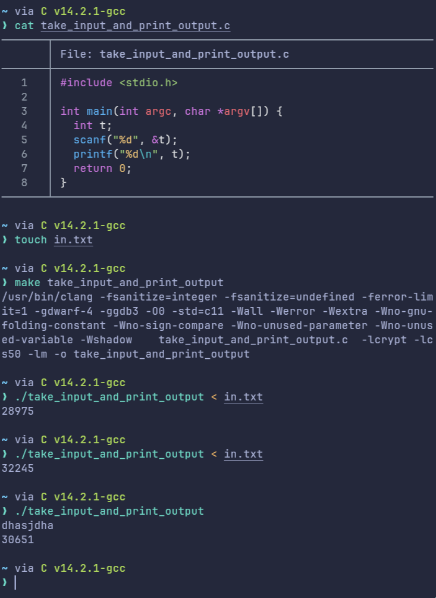
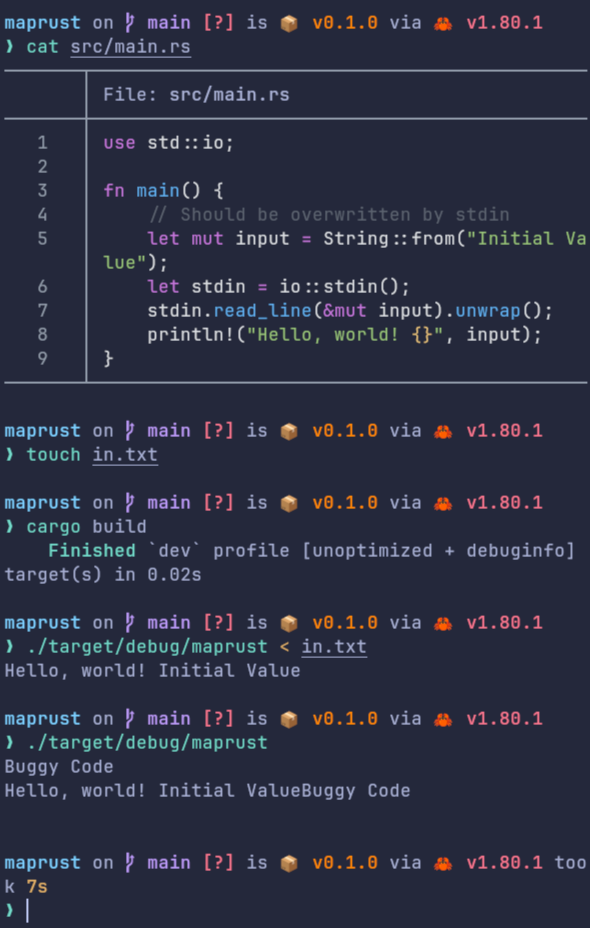

# It was not /dev/null

> Last week, while benchmarking my Rust tool, my PC began to hang due to sudden memory spikes(sometimes > 8 GiB). The surprising twist? A simple C++ program run with nohup and /dev/null helped uncover the real culprit. Let’s dive into how this seemingly innocuous setup revealed unexpected memory issues and the lessons learned about uninitialized variables and process handling.


## Introduction

Last week, I was benchmarking one of my tools named [cpast](https://github.com/rootCircle/cpast) with [hyperfine](https://github.com/sharkdp/hyperfine), and I observed something strange! With the completion of every other odd benchmark, my PC started to hang after a few seconds! The memory usage was spiking a lot ***after*** the benchmark was complete. I was pretty sure, it was not a memory leak, as I was not [leaking any memory intentionally](https://stackoverflow.com/questions/55553048/is-it-possible-to-cause-a-memory-leak-in-rust) and cpast was written in Rust as well, with all memory safety features built-in!



**cpast** in this context invoked multiple threads, each involving spawning a subprocess(to a g++ compiled binary with some I/O). Now, the bug with this design was that, if one thread senses something abrupt, I will explicitly call `exit()` from the program itself, sadly making spawned subprocesses in other sister threads orphan! Now, there is nothing bad with these, we can clean those as well later! But, what caught my attention was this orphan was taking so huge of memory. After all, it was a simple D.S.A. code simplistic enough I couldn't question its innocence!

There was also one more strange phenomenon, after some time, the memory usage of that orphan process would come very down and increase again in a cyclic-like fashion!



## Debugging

After countless hours of debugging, I devised a minimal reproducible example! Coincidentally, I found out that it had nothing to do with cpast(I did fix the non-graceful exit behavior with the tool, but that wasn't the root cause!). The code I was compiling with g++ was the culprit. Upon further research, I also found out, that this has nothing to do with the compiler or operating system in general! The code being compiled looked like this

```cpp
#include <iostream>
#include <vector>

using namespace std;

int main()
{
 int t;
 cin >> t;
 while (t--)
 {
  int n;
  cin >> n;
  vector<int> a;
  for (int i = 0; i < n; i++)
  {
    int x;
    cin >> x;
    a.push_back(x);
  }
 }
 return 0;
}
```

The code above is a very naive and simple code that takes a vector input from user `t` times, that's it!

Now, to invoke this bug, all you need to do is compile this simple program, and start executing this under `nohup ./binary_file_name`. nohup run a command immune to hangups, with output to a non-tty! Since I hadn't given any input to the program yet, so I was pretty clueless about what was causing this sudden spike in memory usage. Logically the program should wait for the input, when given, it should do its tasks and die peacefully!



Out of luck, I took help from one of my college seniors and that's when we found something strange! We simplified the program a lot more and made a wild guess that the problem might be either with nohup or cin itself! But both were pretty standard software/code and for code this simple, we won't expect this to break!

Out of curiosity, we explored the man pages of nohup, it stated and I quote

> If standard input is a terminal, redirect it from an unreadable file. If standard output is a terminal, append output to 'nohup.out'...

Hence, the code was not getting the stdin from tty, so it should fail, right? No! Things are starting to get more weirder!



A simple `ls -al /proc/$(pgrep binary_file_name)/fd` revealed that the stdin of this process was symlinked to `/dev/null`, which in our perception was void/nothing! So, technically `cin` would not be getting the stdin file descriptor and hence it should error out? But why it didn't? We made a classic C++ joke and moved to check the same in Rust. We observed the very same behavior as C++ in Rust as well and that's the time we came to know */dev/null* was something, *something that a program can read*! Actually, */dev/null* file is an empty file and hence whenever you try reading, your OS will signal an EOF(End of File) i.e., it reads nothing and returns the flow to the program from IO. (Think of it equivalent to you having a string input, and pressing enter without any input on the console)



So, cin was recording an EOF, then as it couldn't read any value, and hence it wouldn't write anything to the variable as well! *(But why?)* Hence, in the program above, as all the variables were uninitialized, the value they will be storing will be some garbage value by design. Hence, the value of the **`i`** variable, even after `cin` will be some garbage and it will hence go in the while loop and hence the flow causing repeated loops and memory allocations with vector! *The same will occur for other subsequent `cin` as well!*

```cpp{4-6}
// Import appropriate headers
int main()
{
  int t; // [!code focus]
  cin >> t; // [!code focus]
  while (t--) // [!code focus]
  {
    int n;
    cin >> n;
    // Logic for vector input here
  }
  return 0;
}
```

So, this does correctly explain the unexpectedly high increased memory usage! It was the garbage value and cin writing nothing to a variable, causing all of this chaos! Similarly, the size of the vector got to be very large due to the high garbage value of `n` and hence the big memory usage and cyclic memory discharge nature as observed at the start.

## Explanation for cpast



So, now if we think of *cpast*; the spawned subprocess running the compiled binary, their stdin, stdout and stderr were explicitly piped from the parent process and hence if we called exit in the main program, killing the parent process! The stdin of the spawned subprocess(now orphan) will start to pipe(point) to supposedly a dangling stdin of the parent process (which now doesn't connect to tty) and hence reads EOF!

## Question

Now, there is one questions that I still need answer about.



> [!TIP] The burning question
> ***If `cin`/`scanf` was reading EOF, why it didn't error out when it had to write it to an integer-type variable?***

Upon researching more, I found out that this behavior was undefined in C/C++/Rust alike and value of variable after reading an unexpected value will remain unchanged by `cin`/`scanf` alike. For more information, you can refer to this [thread on stackoverflow](https://stackoverflow.com/a/40552127).



## Conclusion

In this case, we see how not initializing the variable at declaration caused such pain! But, if you think, this is something only local to C++, you will be very wrong, as far as I have tested, this problem inherently exists in programming languages like Rust and C itself! Also, *nohup* was also not the culprit here! The key takeaway was that if `cin` reads an EOF, it didn't error out!

In short, the unexpected memory problems came from running a simple C++ program with nohup and redirecting it to */dev/null*. The EOF from */dev/null* caused uninitialized values and uncontrolled memory growth. This shows that even simple setups can lead to surprising issues. It reminds us of the importance of testing software in different environments to catch problems like these.

## Acknowledgement

I am super thankful to [Aditya Yadav](https://www.linkedin.com/in/aadi58002) for help in debugging this.
