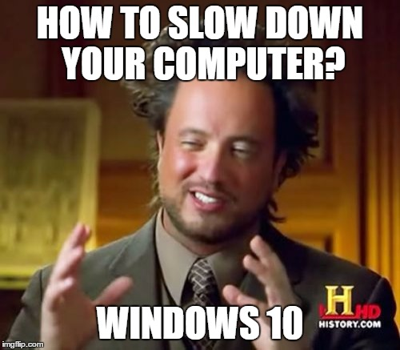

# Linux Drama

Apart from being the best gift to the mankind, Linux(sorry GNU/Linux) is highly extensible operating system. Compared to its competitors, like Windows and MacOS, Linux is created to sound more sane to the developers.

## Myths

1. Linux is faster. (Truth is Windows is bloated)
2. Linux breaks things. (Kinda!)
3. Linux is secure. (You can't take everything for granted)
4. It's all about CLI.
5. I'm writing myths about Linux.

## Increase Battery Life on Linux

1. Install [auto-cpufreq](https://github.com/AdnanHodzic/auto-cpufreq#auto-cpufreq-installer). After Installation, run `sudo auto-cpufreq --install` in your terminal. This will perform a series of process optimizations on your PC. To verify the installation, you can use `auto-cpufreq --stats`, to check if CPU frequency is always less than the max cpu frequency present there. If that's not the case run `auto-cpufreq --force=powersave`.

2. If having NVIDIA graphics card with installed drivers, start using [envycontrol](https://github.com/bayasdev/envycontrol#%EF%B8%8F-getting-envycontrol). Envycontrol is an utility tool that provides easy way to switch between GPU modes, namely integrated hybrid and nvidia. It is more sane to be using integrated as the default one, unless doing hardcore gaming on your Linux System. For using integrated mode, run `sudo envycontrol -s integrated` after installing envycontrol. Then reboot the system.

- If you want to tap into performance mode, use `auto-cpufreq --force=performance` and `sudo envycontrol -s hybrid` or `sudo envycontrol -s nvidia`. Switching directly to nvidia mode from integrated mode might result in error. Users are advised to first switch to hybrid and then to nvidia mode.

## Choosing right distro for beginner
A lone wolf exploring the deep sea in the world of Linux, is generally advised to start with something like Ubuntu, Kali Linux or Manjaro. I am deeply against it for a reason. You must be free to use your own distro of choice, all by yourself for a reason. Choose not what is popular, but what suits you the most.

1. Debian based System: If you want stability, it should be your go to destination for you. I would recommend using `nala` instead of `apt` as package manager for better speed and UI. But, you will be missing extensive build system, faster package manager that doesn't sucks, latest softwares and the exciting world of AUR's.

2. Fedora: If you want bleeding edge kernel drivers with latest software, but with stability, Fedora will be your go to destination. If you have brought some latest TechX dashing laptop, you will intrigued to know that Debian based system might not work well with it out of box, this is generally due to newer hardware not well supported by older Linux drivers. Fedora solves that issue. However, on premise `dnf` is slower by default, unless you have some super-fast high speed internet.

3. Arch based System: This is the zone where best of all world meet and didn't I tell you `I don't use Arch btw ;-)`. From a build system, that will break at every update, to super easy installation, Arch is go to destination for those who don't want to install and forget their OS's. Jokes aside, Arch has super-fast and best package manager, highest quality of documentation in ArchWiki, to extensive resources for all your needs in AUR. With latest Kernel, you are rest assured that you won't be having a problems with drivers. However, Arch is generally not advised for beginners due to its complex installation path and non-stability due to rolling release model. If you want, I will personally advice Endeavour OS, which is basically batteries included Arch. 

## Xorg or Wayland
Xorg and Wayland are basically Display Server Protocol. If that sounds fancy to you, they are basically a bunch of protocols that tells display server how to display things on screen.

With modern OS like Ubuntu shipping Wayland by default, it becomes important to know even what Wayland or Xorg is.

As per what Wikipedia says, ***Wayland is a communication protocol that specifies the communication between a display server and its clients, as well as a C library implementation of that protocol***. Unlike Xorg, Wayland is aimed to be more secure by default, things like KeyLogging etc are more difficult in Wayland(but definitely not impossible).

For a normal user, Xorg and Wayland shouldn't be much of concern, unless you join the dark side of Linux.
I personally prefer Xorg, because of its maturity. Wayland being a relatively newer protocol seems to be breaking things. I know a lot of Wayland enthusiast will argue regarding the same, but there is still time for wayland ecosystem to mature. Softwares like `touchegg` don't seem to work at all in Wayland.

At end I would advice going with your distro's default for your display server protocol.

GNOME has full support for Wayland. While KDE recently is joining the same league, it will be good to see both of them in the common ground.

## GNOME or KDE or Xfce
Desktop Environment or D.E. defines how good or bad your GUI gonna look. Basically, they help provide the GUI interface over top of Kernel.

Most beginner judge each distros is by how they look, but not how they function. I too, was also one of those initially. Look and customization are based on how good or bad your Desktop Environment(D.E.) is, not the distro. One can make Ubuntu look and function, same as Linux Mint within a snap of a minute and same stories goes for other OSes as well.

There are tons of DE in the Linux world, but here we are concerned with only few.

1. GNOME: GNOME comes with saner defaults and beautiful UI, with very little control on customization out of box.

2. KDE: KDE looks more like Windows 7, with tons of customizations available. If you want to take full control of UI, KDE will the right choice for you. Note that this privilege, comes at a price of poor defaults and poor gesture support etc. Unlike GNOME, KDE doesn't come with Wayland by default.

3. XFCE: XFCE, the messiah of all 90's PC's in the world where RAM optimizations sounds like a joke to developers. Xfce is the angel in the desert of unforgiving sands. With Xfce, you can run functional and usable GUI on any system with as low as 512MB RAM on the system.

In conclusion, if you have 4GB or less, I will recommend going with XFCE. If less than 2GB, XFCE is probably your only option. For stronger systems, if you are *Ricing* guy, go with KDE, else GNOME.

## Dual Boot or Virtual Box

For a beginner, I would recommend starting with Virtual Box, if your system specifications support that. It will provide ample opportunity for you to learn about Linux ecosystem. Running in Virtual Box will ensure that you don't destroy your own system, trying tinkering with the distro. 

It is worthy to note that, Virtual Box may slow down your system due to high RAM usage, preferably dual boot your system as fast as possible. In course of time, if you started hating windows, you can remove your  Windows installation altogether.

::: info
It is advised to perform full system backup before installing Linux.
:::
Common misconceptions with Dual Boot includes
1. Dual Boot will lead to loss of data, which it certainly not.
2. Dual Boot will make Windows run slower. No, it doesn't. Your Windows installation is independent of your current Linux installation.

## Choosing the Right Software 

One problem that most beginner face is lack of apps with good UI, so it becomes important to find the right ones. Down below are some of the software, I prefer to use. They will be easily available in your package manager or software center.

::: details For Developers
ripgrep: Search file content, useful to find a css class reference etc. 
nvim: Better text editor, customizable to provide faster development time than VS Code 
dust: Enhanced du 
delta: diff like tool to compare file 
colordiff: Colored diff 
fd-find or fd: CLI based File finding utility 
time: Resource analyzer for a process 
shellcheck: A linter like tool for bash scripting 
valgrind: Check memory leaks 
btop: Nice terminal based process manager with great TUI 
python-pip: If you ever want that `pip install` 
ninja cmake: Build Systems 
nodejs yarn npm: For Web Developers 
sqlitebrowser: For all your sqlite needs, but with GUI. 
mariadb or mysql: For all your MySQL needs 
mysql-workbench: To manage MySQL for GUI 
jdk17-openjdk-devel: For JAVA developers. (Yes, they exists!) 
discord: The platform of get all the help. 
cowsay banner: Say anything 
espeak-ng: TTS in terminal for fun 
docker: If you need it. 
tgpt: ChatGPT in Terminal 
visual-code-bin or code: The preferred text editor 
eclipse-java: IDE for JAVA developers 
intellij-idea-community-edition: Better JAVA IDE for developers 
android-studio: Experience the bloat-verse in Linux 
pycharm-community-edition: For serious Python developers 
anaconda: For data scientists 
gcc clang g++ make: For compiling C, C++ code. 
git: VCS tool for those whose who can commit. 
xclip fzf: Extra utility tools, recommended for better integration 
:::

::: details Productivity
libreoffice-still gnumeric: MS Office is always jealous of this. Free office tools 
OnlyOffice: Office suite, but with much better GUI 
OBS: For all your recording and streaming needs. 
evince okular: PDF viewers 
lollypop: Great looking Music Player 
spotify: Another music player, but with those annoying ads 
kate: Text Editor, if you use KDE 
vlc kaffeine totem: Another Video Player 
qbittorrent: For all your torrenting needs. 
portmaster: A open source extensible firewall with GUI.(Highly recommended for security) 
kwalletmanager keepassxc: For saving passwords locally 
flatpak: Unlock tons of software from some another world  gparted: Helps in partitioning your drive 
eog gwenview shotwell: Some good Image viewers 
gimp inkscape krita pinta darktable: Image Processing & editing tools but for free 
thunderbird: A highly sane email client.(Poor UI by default, but can be modified) 
telegram-desktop whatsapp-for-linux: If you use IM's. 
firefox: Go to Browser for you, with best security practice and better focus on privacy. 
Notejot: A beautiful note taking application. 
drawing: A MS Paint alternative 
gscan2pdf: A versatile tool. I use it to create customizable PDF from Images. 
pitivi: Some great video editing tool. 
rnote xournalpp: Excellent note taking apps. 
scrcpy: To share phone's screen on PC and control it. 
Gnirehtet: To reverse tether internet from PC to Phone 
:::

## TBC

::: warning
Views are personal
:::
