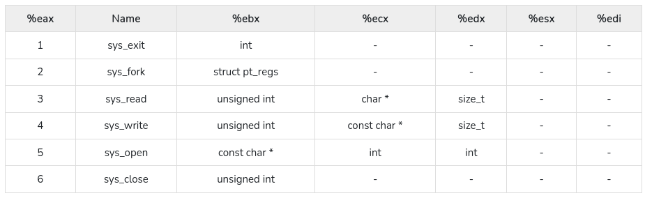

# Getting Started with Assembly


Clickbait! Isn't it? These days when everyone want to indulge into trending tech like Blockchain & Machine Learning, you might question, why are you here? Good that you ask, because what you are going to learn with this blog is, if not the most interesting, is the most aggressive & performant language. Trust me, it's not C.


## Applications of Assembly

Every developer one day or another had at-least once fantasized about learning Assembly. Is it hard? No. Why we don't we learn it? Because we can't find a application in our day to day development. What we as a developer are developing, requires a highly abstracted knowledge of things to get started. You need not to understand Gecko or V8 engine to write a simple javascript code. Although concepts like [WebAssembly](https://developer.mozilla.org/en-US/docs/WebAssembly) do exists, there usage are still sparingly low.

However, keeping those aside, if we talk about applications of Assembly here's what the one and only, ChatGPT has to say

1. Embedded Systems Programming: Assembly is often used in programming embedded systems, such as microcontrollers, where resource constraints and real-time performance are paramount. Writing code directly in assembly allows for precise control over hardware components and efficient memory usage.

2. Device Drivers: Assembly is sometimes used to write low-level device drivers that interface with hardware components like graphics cards, sound cards, and network adapters. These drivers require direct interaction with hardware registers, which assembly excels at.

3. Operating System Kernels: Certain critical parts of operating system kernels may be written in assembly language to ensure optimal performance, especially in areas where hardware control or system-level operations are necessary.

4. Real-Time Systems: Applications that require strict timing constraints and real-time responsiveness, such as robotics and industrial automation, might use assembly to achieve the necessary precision and timing.

5. Reverse Engineering and Security Research: Assembly is often used by security researchers and reverse engineers to analyze and understand software vulnerabilities or to reverse-engineer binary executables.

::: info Fun Fact
[Ghidra](https://ghidra-sre.org/): It is a tool made by NSA to unveil the secrets of binary executables through its open-source power, diving deep into assembly to dissect, analyze, and comprehend software intricacies. Basically, it can easily convert a binary into a assembly code, using a thing called disassembler.
:::

## Setting Up the environment

There are many ways to run assembly code, using assembly compilers like [yasm](https://yasm.tortall.net/) or [nasm](https://www.nasm.us) or using native C compiler like [gcc](https://gcc.gnu.org/). In this tutorial, I will be exclusively using gcc to run the assembly code.

### Prerequisite

1. Code Editor like vi, nano, vscode, sublime, etc.
2. C Compilers like gcc or clang. (gcc is preferred here, but clang can also work with modifications)
3. [Optional] Basic understanding of C as a programming language
4. [Optional] [yasm](https://yasm.tortall.net/) or [nasm](https://nasm.us/)

## Understanding how memory works

When it comes to memory, there is a lot of misconception around how data is stored, retrieved and called. When learning a low level programming language like Assembly, it becomes crucial that you get well versed with the basics first. Feel free to skip this part, if you have general idea of memory, registers and CPU.

### A.L.U.

Every time, you do something on your Mac or PC, a instruction is generated for your A.L.U.(Brain) to execute. Assume, A.L.U. to be the working prototype of real life human brain, dealt with thinking only. Now what you thought need to stored somewhere for future reference, and that's where memory comes in. There are Registers, RAM, ROM and Storage Devices like Hard Disks and Pen drives. 

Before, it all gets too overwhelming for you all, remember them just as names, put a blind eye on their function, unless they seems to become important. This is a classic CS50x approach, practiced by millions students around the globe, when getting started with C for the first time. It's ok, if you aren't able to grasp one or two things, what is more important is to understand rather than memorize the jargons.

### Memory & R.A.M.


So, getting back, we were talking about how information are stored in memory. Actually, think of your RAM chip as a huge 2D M x N grids, where each block contains some information. When we deal with those large number of grids, it's more important that you assign some identifying information to each grid, such that we can reference them later easily, without any ambiguity. In terms of computer world, we call such references, memory address. Memory address are nothing special but a numbered address, where first box is 0, second is 1 and so on till the capacity of entire grid. In general programming world, memory are represented using [hexadecimal](https://www.google.com/search?q=hexadecimal) number instead of [decimals](https://en.wikipedia.org/wiki/Decimal) as a standard notation. However, if you are unfamiliar with it, then can completely skip that part. 

### Memory Hierarchy and Registers


As we now know about those boxes and grid, now comes the interesting part, the rise of a new problem. The problem is, with having so many boxes in a grid, it can soon become pretty problematic. Let me explain, why. Assume a situation, you are the captain of a football team, and you need to assist your team in making one goal. So, information need to transmitted only between 10 members only (excluding captain). Now assume, a much bigger team having hundreds if not thousand members in the team. Then how difficult it will be for the captain to guide the team. 

In terms of computer memory, in empirical terms **Space ∝ 1 / Speed**. The higher the memory space, slower the speed of that devices, empirically. Now, with that relations comes the real problem, our A.L.U. aka, the brain is really fast, but memory devices like RAM aren't. So, what we come up, was a Tree like structure where ALU was connected to Registers that was connected to Memory and finally to Storage Devices, just like root is to branches. It is important to know that Memory and Registers are volatile memory. 

Now, if we talk about Registers, they are the fastest, but the smallest piece of memory unit. They are present as a part of CPU and helps store data & instructions temporarily, for caching results etc. Our lovely A.L.U. although can think, it's not powerful enough to run N tasks at once, at-least for simple computers (Let's not get into details of [Process synchronization](https://www.geeksforgeeks.org/introduction-of-process-synchronization/) and [parallelism](https://en.wikipedia.org/wiki/Parallel_computing)). So, to perform a task, it needs to be divided into simple clear instructions, that CPU can understand and rest is stored in registers as a reference or as a whole.

R.A.M. having the much larger capacity on the other hand, stores the data rather than references. The references to those data are stored in registers, when needed. Storage devices, similarly stores permanent data that needs to be persistent, even after the boot.

:::info NOTE
Registers also can store data like RAM, but their size and width is constrained.
:::

### Word Size

Now, I assume you have the basic understanding of Registers and Memory. Let's comeback to our, grid & box story. Remember, memory is a grid having large number of boxes, and each box stores some information in binary form. Now, you might be thinking, what does these boxes store? A single 0 or 1, a byte of 0s and 1s or something else. Answer is, with advent of newer technologies, the memory size began to increase rapidly, now the numbers of bits required to represent those addresses will hence, also increase. So, apart of using generic conventions like byte, we started using *words* as a unit. A word is **minimal addressable unit** stored in a memory. Word can contain any number of bytes, it can one, half, two and so on. Essential to know that, width of the words is dependent on the architecture and memory size and also some other parameters.

:::info
Memory stores each bits in hardware made up of flip-flops.
:::

### How a program is run?

So, you are now familiar with basics of Memory Organization. Let's talk about what happens when you click on the tiny icons present on your desktop window. When you start a program, it starts a series of steps, i.e.,

1. Loading: When you execute the program, the program executable (the .exe file on windows) is loaded from your storage device into your memory blocks aka RAM. Your OS reads the binary instructions and other relevant stuffs and pass it onto the memory.

2. Memory Setup: Memory regions are setup for stack, heap etc for future use.

3. Instruction Fetch & Decode : Instruction is fetched from memory one by one in CPU and is decoded into registers.

4. Execution: After decoding the instructions, ALU performs the required operations, memory read is performed if required and then the output is written back to the memory.

5. Termination: Eventually, the program reaches an exit point. At this point, the CPU stops executing instructions from the program.

6. Cleanup and Memory Deallocation: The operating system releases the memory and resources allocated to the program. This includes deallocating memory from the heap, closing files, and cleaning up any other resources used by the program.


After all these stories, I hope you understand the basics of memory organization, there's still a lot to these, but it isn't the scope of this discussion, so we are simply going to ignore them, unless needed.


### Understanding Instructions

An instruction is a fundamental unit of operation that a computer's ALU can execute. It is a command given to the CPU that tells it to perform a specific operation, such as arithmetic computation, data movement, logical comparison, branching, or control flow. Instructions may vary from computer to computer based on architecture and complexity of the PC.

Frequently used instructions include MOV, ADD, SUB, LOAD, JUMP, CALL, etc. Explanation for some common instructions are given below

- LOAD loads value from memory into registers.
- ADD is to perform addition.
- JUMP is to control flow statements.
- MOV is to copy data from one address to another address.

## Writing Your first assembly code


1. Open your favorite text editor and make a new C file, let's say `asmGuide.c`.

``` c
#include <stdio.h>

int main(void)
{
    int src = 66;
    int dst;   

    asm ("mov %1, %0\n\t"
        "add $3, %0"
        : "=r" (dst) 
        : "r" (src));

    
    printf("%d\n", dst);
    
}
```

2. Save the file and then open the terminal, in the containing directory and then run the commands

``` bash
gcc asmGuide.c -o asmGuide
./asmGuide
```

If everything works fine, you will see `69` as the output.

## Understanding the code

Before the code gets too overwhelming to you, let's break them into simple units. If you are coming from C coding background, you might very well know the include header statement, `#include <stdio.h>`, which is used to import a set of helping hands, that can help perform magic things like taking input, printing to console (like in here) etc, without explicitly defining them, how to do those.

The `int main(void) {}` is the entry gate to your code, it acts as the front door to your program code i.e., from where the CPU should start from when executing statements. `int` in `int main` denotes that this function returns an integer. If you don't know why, then we can leave this information for future discussion. `void` under params tells that it doesn't expect any command line parameters, when running from console. And then comes the variable, `int src = 66;` and `int dst;`. In programming language like C, every statement(not expression) ends with a semi-colon `;`. Seeing the variables, it might seems obvious that, you are declaring a variable name `src` to value `66`, we are telling in advance to the compiler that `src` is of type integer. Similarly, in `dst`, we are only concerned with telling that a variable named `dst` exists, but its value is not defined, think of it as more as a labelled but empty cartoon. And finally, the `printf` statement is used to print the value stored inside `dst`. Now, it may seem counter-intuitive to you, how may we print or get that value of `dst`, outside of a cartoon, when actually there was nothing inside and that's where that magic `asm` codes comes to play.

Inside the `asm`, you might see some familiar commands like mov and add. %0 and %1 are placeholders denoting the first and second argument i.e., `dst` and `src` respectively, while $3 jump denotes *decimal* number 3. `\n\t` are whitespace characters and are intended for indentation purpose only, thing on which we can turn our blind eye for now. Now, let's understand the code

- asm is compiler specific directive found specifically in gcc, to help run assembly codes right from C code.
- `mov %1 %0` will copy %1 into %0 i.e., `src` into `dest`. So, now `dest` now also becomes 66.
- `add $3 %0` will add 3 into %0 i.e., `dest`. So, now `dest` now becomes 69.

Easy right? Yes this is assembly!

## [Optional] Writing pure assembly codes

Now you know the very basics about assembly syntax, let's delve deeper and start writing pure assembly functions. Before that you must know the basics, around assembly programming language.

### Comments

Single-line comments are denoted in assembly by using `;` operator.

### Data Types

There are no data types in assembly, but we need to take care of context. For example, letter 'a' is denoted to your computer's memory using ascii notation as 65. But, computer couldn't differentiate if 65 is an integer, string, character or anything else. So, it becomes important that we as a developer keep track of those things.

### Structure of Assembly code

A typical assembly code contains three sections, i.e.,
```x86asm
section .data

section .bss

section .text
```

- `section .data` is where constant variables is defined, like strings, magic(constant) numbers, terminating strings, etc.

- `section .bss` is for variables reserving space in memory for future data use, like taking input from user for string etc.

- `section .text` is where actual code will be, and it starts with label like `_start:` or `_main:`. These labels usage vary from linker to linker, like ld linker requires `_start` as the start label, while gcc asks for the latter `_main` label. These labels are nothing but a typical entry point, to your program.

### Compiling your code

To run, your lovely assembly code, you need to perform a series of tasks, i.e., compiling it. For this, you can use any assembler like nasm or yasm, whatever you like. Assuming your assembly code is written in file.asm file, here are set of steps to successfully run your code from terminal.

``` bash
# Returns an file.o file
nasm -f elf64 -g file.asm # elf64/elf32 controls the registers size
# Alternatively can use yasm too, works the same
yasm -felf64 file.asm
# Linking your file.o file
ld -m elf_x86_64 -o file file.o #elf_x86_64 controls type of architecture 
```

Now, to run your code, simply type `./file` or `.\file.exe` in terminal, depending on the OS and voila your first assembly code has run successfully. 

### Common Registers for 32bit Systems


Now, in normal assembly code, we deal a lot with registers, think of them as normal variables that are designed to store and retrieve some specific values and are generally proposed for some specialized functions. Some of the common registers include

- EAX: Accumulator Registers, results of arithmetic registers are stored here!
- ECX: Counter Registers
- ESI: Source Index for copying large piece of data
- EDI: Destination Index for copying large piece of data
- ESP: Stack pointer, points at the top of the stack
- EBP: Base pointer, points at the bottom of the stack
- RIP: Stores the instruction pointer

:::info Fun fact
When dealing with 64 bit registers, you might see RAX, instead of EAX, although EAX can still be used, even then too.

EAX, there will be lower significant half of the RAX register, occupying lower 32 bits of RAX. Very similar to what AX is to EAX. (Refer diagram above for details)
:::

### Common commands/instructions

#### Move operator
``` x86asm
mov dest, src ;copy data from src to dest

; movzx = mov zero extend
movzx eax, 3 ; copy number 3 into eax and zero out rest of other bits in eax 

; [] are used for dereferencing(translating) data
movzx eax, byte ptr [ebx] ; copy one byte from address stored in ebx, and store them into eax

; movsx = mov sign extend
movsx dest, src ; assume src is negative number, then that will be sign extended for remaining empty boxes
```

:::info Good to know
[Most significant bit](https://en.wikipedia.org/wiki/Bit_numbering) of negative number is always 1 in binary, it signifies that the number is negative for your PC.
Check [this](https://stackoverflow.com/questions/1049722/what-is-twos-complement) out for clean explanation. 
:::

#### Bitwise operations
```x86asm
and dest, src ; Finding bitwise and of dest and src and store it in dest
or dest, src
xor dest, src
test eax, eax ; check whether eax = 0, only updates the flag registers and don't updates the eax
```

#### Arithmetic operators
```x86asm
add eax, ebx ; eax = eax + ebx
sub eax, 15 ; eax = eax - 15
inc eax ; eax += 1
```

Performing multiplication/division in assembly is a bit different than addition/subtraction.
```x86asm
mov ax, 15
mul bx ; dx:ax = ax * bx (Lower 16 bits in stored in ax, and upper 16 bits are stored in dx to account for overflow)
div bx ; ax Rdx = dx:ax / bx ,Remainder is stored in dx and quotient in ax
```

#### Flag Register
- CF: carry flag register (1 yes, 0 no)
- OF: overflow flag
- ZF: zero flag (if result of operation is zero)
- SF: sign flag (negative 1, positive 0)
- PF: parity flag (even 1, odd 0)

#### Jump operations
```x86asm
jmp label1 ; Jump to label1
je label ; Jump equal, jump iff previous operations, resulted in equality
jne label; Jump not equal, jump iff previous operations doesn't resulted in equality
```
Some more jump commands
- jz: jump if zero
- jc: jump if carry
- jo: jump if overflow
- jg: jump if greater
- js: jump if sign flag
- jge: jump if greater than or equal to
- jl: jump if less than
- jle: jump if less than or equal to
- ja: jump above based on flag. It checks if the unsigned source operand is strictly greater than the unsigned destination operand. It jumps if the CF (Carry Flag) is clear (0) and the ZF (Zero Flag) is clear (0).
- jae: jump above equal based on flag
- jb: jump below based on flag. It checks if the unsigned source operand is strictly less than the unsigned destination operand. It jumps if the CF (Carry Flag) is set (1).
- jbe: jump below equal based on flag

:::warning INFO
Add n to any of these above, to get its opposite. Like jnz => jump if not zero, etc
:::

#### Call operations
During call operations, program saves the current location, so as to return after the jump (you are going, but returning back too).

```x86asm
; Implemented using stack
call label 
```

:::details Working of call
The working of call can be seen as below : 

```x86asm
call label
    push rip ; rip is the instruction pointer, pushes (current location + 1) address to stack
    jmp label

ret ; return control
    pop rip ; get back to instruction next to calling instruction
```
:::

#### Compare operators

They updates the flag register only, not the operands.

```x86asm
cmp eax, abx; if eax - ebx > 0, then flag(zero, sign etc) is updated
cmp eax, 25
```
:::details Example
```x86asm
cmp eax, 5
ja label ; jump if eax - 5 > 0
```
:::

#### Shift operators
Shift operations involve moving the bits of a binary value left or right by a specified number of positions, altering its value and structure.

```x86asm
shr eax, 1 ; Shift right by 1 bit (Divide by 2^1)
shl eax, 3 ; Shift left (Multiply by 2^3)
sar eax, 1 ; Shift arithmetic right, retains the most significant bit(sign) rest same as shr
sal eax, 2 ; Shift arithmetic left, Similar to shl
```

#### Rotate operations

A rotate operation shifts the bits of a value to the left or right while wrapping the shifted bits around, preserving the bits that are shifted out.

```x86asm
; 00001001 Original data
; 10000100 rotate right by 1 bit

ror eax, 1 ; rotate right by 1 bit
rol eax, 1 ; rotate left 
```

### Bit masking

In assembly language, as you become familiar with various commands, the ability to extract specific bits from a value becomes essential. This allows you to isolate and manipulate targeted portions of data, enabling precise operations on specific positions within the value. Think of it as, let's say you are rounding off a number, then for you, only the significant bit seems necessary, rest are just useless, same story here. You might sometimes come in a position, where you will require a range of bits rather than entire data, in those cases, role of bit masking comes to play.

Assume a situation, you want to extract 2 to 30 bit range from a 32 bit data register. What you will do is, is to make a AND with 0111111111111111111111111111111100 and then unnecessary bits will be zeroed out (why?), and then perform necessary shift operations to extract the number.

Example :
let eax = 01010101010010101001010101101010, now to extract most significant 16 bits, we do
```x86asm
; 0xFFFF0000 is same as 11111111111111110000000000000000

and eax 0xFFFF0000 ; To extract first 16 bits
shr eax, 16 ; shift right by 16 bits, to make required bits come to left
ax ; will hence store the required data, refer Register Diagram above for info in #Common Registers for 32bit Systems
```

### System calls



```x86asm
mov eax, 1 ; Invoke the kernel to sys_exit
int 80h ; interrupt is invoked to kernel, to perform the task as per values in eax and other relevant registers (Refer table above for reference)
```

:::details To print any string in assembly
print(stdout, hello_world, x)
```x86asm
mov edx, len ; .data variable
mov ecx, msg ; .data variable
mov ebx, 1 ; stdio
mov eax, 4 ; sys_write
int 0x80
```
:::

## Hello World Program

Now, with all so many facts and information on the ground, it's the perfect time to write our cool, nice old hello world program. Before that, ensure that the [environment](#setting-up-the-environment) is setup and you have the `nasm` or `yasm` assembler. 

Now, write this code in your favorite code editor and save them as file.asm.

```x86asm
section .data
    ; db means declare bytes i.e., every member reserve a byte
    ; hello is a variable, which stores the pointer to the string
    ; 0xA is for newline character
    hello db "Hello, World!", 0xA

    ; len is variable which equals(equ) end of string + 1($) - start of string(str), giving the length of hello variable
    len equ $ - hello

; we don't need section .bss here

; Make _start accessible to external code
section .text
    global _start

_start:
    mov eax, 4 ; sys_write
    mov ebx, 1 ; file descriptor (stdout)
    mov ecx, hello ; pointer to message
    mov edx, len ; message length
    int 0x80 ; invoke sys_call

    mov eax, 1 ; sys_exit
    xor ebx, ebx ; exit status
    int 0x80 ; sys_call for exit
```
Then for running follow [Compiling Your code](#compiling-your-code) section for details.

## Some advance codes

Now, as we are done with our classic Hello World Program, let's move on to writing some more complex codes requiring conditionals and looping. For this, we are first going to write the corresponding C code and then transpile them into assembly ourself.

### Conditionals

Below is a classic C code based on if, else_if, else conditions.

```c
if (x == a) {
    c += a;
}
else if (x == b) {
    c = b;
}
else {
    c = 1;
}
```

Let's transpile the above C code into assembly code

```x86asm
; Here we are going to use some common registers at our premise
; eax x
; ebx a
; ecx b
; edx c

section .data
    msg db 0, 0xA   ; Initialize a variable to hold the message

section .text
global _start

_start:
    mov eax, 1 ; Set eax (x) to 1
    mov ebx, 1 ; Set ebx (a) to 1
    mov ecx, 7 ; Set ecx (b) to 7
    mov edx, 2 ; Set edx (c) to 2

    cmp eax, ebx      ; Compare eax and ebx (x and a)
    jne elseif_label  ; Jump to elseif_label if not equal
    add edx, ebx      ; Add ebx (a) to edx (c) if equal
    jmp done_label    ; Jump to done_label after processing

elseif_label:
    cmp eax, ecx      ; Compare eax and ecx (x and b)
    jne else_label    ; Jump to else_label if not equal
    mov edx, ecx      ; Move ecx (b) to edx (c) if equal
    jmp done_label    ; Jump to done_label after processing

else_label:
    mov edx, 1        ; If none of the conditions match, move 1 to edx (c)

done_label:
    ; Print the value of d variable
    add dl, '0'       ; Convert the result in dl to ASCII, may result in overflow if dl > 9
    ; dl is a part of register of EDX, storing least significant 8 bits of EDX
    ; ASCII since requires 8 bits only needs to be stored in dl register of EDX, rather than EDX 
    ; For more info on dl, refer #Common Registers for 32 bits System Section

    mov [msg], dl     ; Store the result in msg variable

    mov eax, 4        ; sys_write
    mov ebx, 1        ; file descriptor (stdout)
    mov ecx, msg      ; Load the address of the message
    mov edx, 2        ; message length (one for number, other for newline)
    int 0x80          ; invoke sys_call
    
    ; Exit the program
    mov eax, 1        ; sys_exit
    xor ebx, ebx      ; exit code 0
    int 0x80          ; invoke sys_call
```

### Iterating using loops

It is now the perfect time to jump into weeds of looping and see how our assembly actually approach these type of situations.

Down below, is a classic loop example implemented in C, which iterate from x=0 to 4 and prints each value of x on console 

```c
for (int x = 0; x < 5; x++) {
    printf("%d", x);
}
```

Again, let's transpile the above C code into assembly code


```x86asm
; eax, ebx, ecx, edx = sys_write operations
; edi = x
section .data
    msg db 0

section .text
    global _start

_start:
    xor edi, edi ; Reset edi to 0

loop1:
    add edi, '0' ; To make it ASCII representable
    
    mov [msg], edi

    mov eax, 4   ; sys_write syscall number
    mov ebx, 1   ; file descriptor (stdout)
    mov ecx, msg ; address of the character to write
    mov edx, 1   ; length is only 1 character
    int 0x80     ; interrupt to make system call

    sub edi, '0' ; Return to number version

    ;inc dil
    add edi, 1
    cmp edi, 5
    jl loop1

    ; Exit the program
    mov eax, 1   ; sys_exit syscall number
    xor ebx, ebx ; exit status
    int 0x80     ; interrupt to make system call
```

### Calling Standard Functions in C

Calling functions in C requires some linking, apart from normal coding. We will create a `extern` call to printf, so that it can be accessed in the program. I have written this code for 64 bit based PC architecture, a 32 bit version can be transpiled easily with a bit of tweaks.

```x86asm
section .data
    format db "%d", 10, 0   ; The format string for printf, includes newline

section .text
    global _start
    extern printf

_start:
    mov rdi, format      ; Format string
    mov rsi, 7           ; Number to print
    xor rax, rax         ; Clear rax (syscall number for printf)
    call printf
    xor rdi, rdi         ; Exit status 0
    mov rax, 60          ; syscall number for exit
    syscall
```

To run the above code, we will requiring linking the libc libraries, so here are some modified commands. Commands might vary from architecture to architecture, the below code is for standard 64bit Linux environment.

```bash
nasm -f elf64 -o file.o file.asm
gcc -nostartfiles -o file file.o -lc -no-pie
./file
```

:::details Brief Idea of working of printf as stack 
```x86asm
printf:
    push eax
    push ebx
    push ecx
    push edx
    push ebp
    mov ebp, esp ; Making the stack virtually empty, by making base and stack pointer point to same location
    
    mov eax, esp + 28 ; 28 bits for 7 bits pushed in stack, to access the base pointer respectively

    ; printing magic happens here, code leaved for brevity

    pop ebp
    pop edx
    pop ecx
    pop ebx
    pop eax
```

In memory design, highest memory address denotes the base of stack, while lower memory address denotes the top/stack pointer. Kinda opposite :-)
:::

:::info NOTE
Command line arguments are typically sequentially pushed onto the stack, allowing the program to access and utilize them by calculating their addresses relative to the stack pointer.
:::

## Conclusion 

I hope, this "Assembly 101" guide introduced you to assembly language programming, showing how it's used in various areas like system programming and code optimization. We covered setting up our environment, understanding memory basics, writing our first assembly code, and grasping its meaning. We even touched on more advanced assembly techniques. By the end, we created a classic "Hello World" program, marking our progress and preparing us to explore assembly language further for efficient software development. Hope you liked the content!

## References

- [x86 NASM Assembly Crash Course by UMBC IEEE](https://www.youtube.com/watch?v=DNPjBvZxE3E)
- [Learn NASM Assembly Programming Language](https://www.tutorialspoint.com/assembly_programming/index.htm)
- [CS50x View on Memory](https://cs50.harvard.edu/x/2023/notes/2/#arrays)


